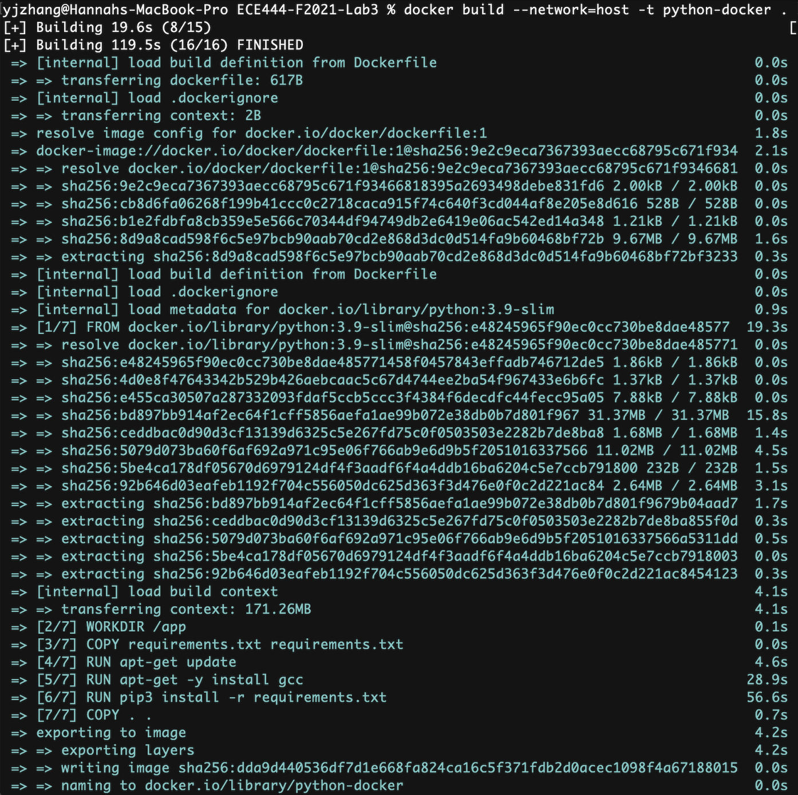
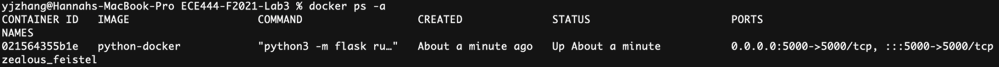
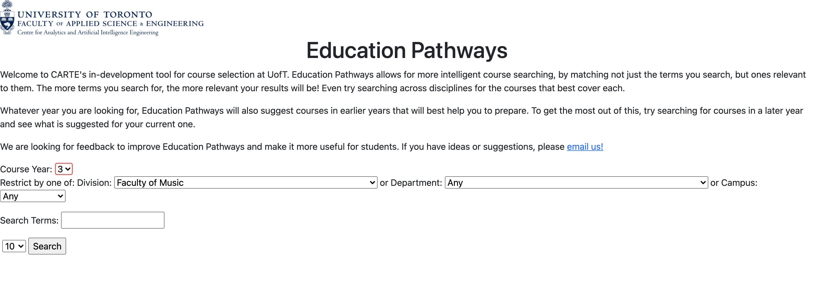

# ECE444-F2021-Lab3
Name: Yi Jia (Hannah) Zhang
 
This repo is a clone of https://github.com/nelaturuk/education_pathways

## Activity 1

## Activity 2

## Activity 3

## Activity 4
Screenshot of Flask app running on localhost:5000

Screenshot of running docker image

## Activity 5 Feedback on Education Pathways application
After exploring the application I've picked one functional and one non-functional requirement of the system that can be improved.
### Functional Requirement: Unable to search courses base on Department or Faculty without having a search word in mind
As shown in the screenshot below, the user is unable to search available courses offered by a certain department or faculty. When user tries to hit search after selected the faculty and left the search bar empty, the webpage will simply redirect itself back to the Home page. This function requirement is important as some student may want to search different courses offered by a departement to fulfill their graduation requirement. For example, some student might only know that they need a CSC credit to graduate, but they have no idea what courses are offered by the computer science department. In this case, the feature of searching courses solely by department in good to have.

### Non-functional Requirement: The Output Format of the Web page
We can see from the screenshot shown below. The website is formatted as a table containing course information related to your search keywords. However, the alignment of the information can be a little confusing. The column titles are algined to the right, yet the content for each column are aligned to the left. This format problem may seems negligible when the content in a cell is filled entirly from left to right. However, in the "Course Level" attribute the data are shown as a single integer, which cause a vertical mis-alignment of information, creating an illustion that there are two columns in the end. Although the website display does not affect the basic functionality of this web application, it does somehow affect the usability.
